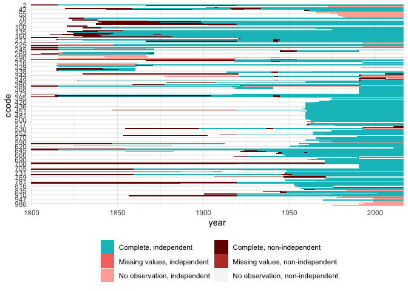

<!-- README.md is generated from README.Rmd. Please edit that file -->

# states

<!-- badges: start -->

[](https://github.com/andybega/states/actions)
[](https://cran.r-project.org/package=states)
[](https://codecov.io/github/andybega/states?branch=master)
<!-- badges: end -->

Create country-year/month/day panels consistent with the COW or
Gleditsch & Ward lists of independent states. I mainly use this for
merging different data sources:

1.  Create a master template that reflects one of the independent states
    lists.
2.  For each data source, normalize to a copy of the master template.
    Doing this by source makes it easier to identify and address issues
    like missing values or observation for non-independent states.
3.  In the end, merge everything together. Since all the inputs are
    already normalized to a proper state panel list, there should be no
    issues.

What the package does:

-   It contains the Gleditsch and Ward (G&W) as well as the Correlates
    of War (COW) state system membership lists.

``` r
library("states")
    
data(gwstates)
data(cowstates)
```

-   Search them with `sfind`, this can be helpful for manual coding:

``` r
sfind(260)[, 1:6]
#>     list ccode code3c            country_name      start        end
#> 45    GW   260    GFR German Federal Republic 1949-09-21 9999-12-31
#> 299  COW   260    GFR German Federal Republic 1955-05-05 1990-10-02
sfind("German")[, 1:6]
#>     list ccode code3c               country_name      start        end
#> 44    GW   255    GMY          Germany (Prussia) 1816-01-01 1945-05-07
#> 45    GW   260    GFR    German Federal Republic 1949-09-21 9999-12-31
#> 46    GW   265    GDR German Democratic Republic 1949-10-05 1990-10-02
#> 297  COW   255    GMY                    Germany 1816-01-01 1945-05-08
#> 298  COW   255    GMY                    Germany 1990-10-03 9999-12-31
#> 299  COW   260    GFR    German Federal Republic 1955-05-05 1990-10-02
#> 300  COW   265    GDR German Democratic Republic 1954-03-25 1990-10-02
```

-   You can use it to build a country-year template that matches either
    the COW or G&W state lists.

``` r
countries <- state_panel(1991, 2001)
    
str(countries)
#> 'data.frame':    2091 obs. of  2 variables:
#>  $ gwcode: int  2 2 2 2 2 2 2 2 2 2 ...
#>  $ year  : int  1991 1992 1993 1994 1995 1996 1997 1998 1999 2000 ...
```

-   Visualize missing/non-independent cases in your data. See this
    related [blog post for more
    details](https://www.andybeger.com/2016/09/14/data-management-and-missing-data/).

``` r
data("polity")
str(polity)
#> 'data.frame':    17228 obs. of  3 variables:
#>  $ ccode : num  700 700 700 700 700 700 700 700 700 700 ...
#>  $ year  : num  1800 1801 1802 1803 1804 ...
#>  $ polity: num  -6 -6 -6 -6 -6 -6 -6 -6 -6 -6 ...
    
plot_missing(polity, x = "polity", ccode = "ccode", statelist = "COW")
```



For the underlying data (missing info requires date input):

``` r
polity$date <- as.Date(paste0(polity$year, "-01-01"))
mm <- missing_info(polity, x = "polity", ccode = "ccode", 
                   time = "date", period = "year",
                   statelist = "COW")
head(mm)
#>       ccode       date independent missing_value                    status
#> 18671     2 1800-01-01           0         FALSE Complete, non-independent
#> 18672     2 1801-01-01           0         FALSE Complete, non-independent
#> 18673     2 1802-01-01           0         FALSE Complete, non-independent
#> 18674     2 1803-01-01           0         FALSE Complete, non-independent
#> 18675     2 1804-01-01           0         FALSE Complete, non-independent
#> 18676     2 1805-01-01           0         FALSE Complete, non-independent
```

## Install

The package is on CRAN and can be installed with:

``` r
install.packages("states")
```

Or to install from GitHub:

``` r
library("remotes")
remotes::install_github("andybega/states")
```

## Citations

For the [Gleditsch and Ward (G&W) state
data](http://privatewww.essex.ac.uk/~ksg/statelist.html):

Gleditsch, Kristian S. & Michael D. Ward. 1999. “Interstate System
Membership: A Revised List of the Independent States since 1816.”
International Interactions 25: 393-413.

For the [Correlates of War (COW) state
data](https://correlatesofwar.org/data-sets/state-system-membership):

Correlates of War Project. 2017. “State System Membership List, v2016.”
Online,
<a href="https://correlatesofwar.org" class="uri">https://correlatesofwar.org</a>
